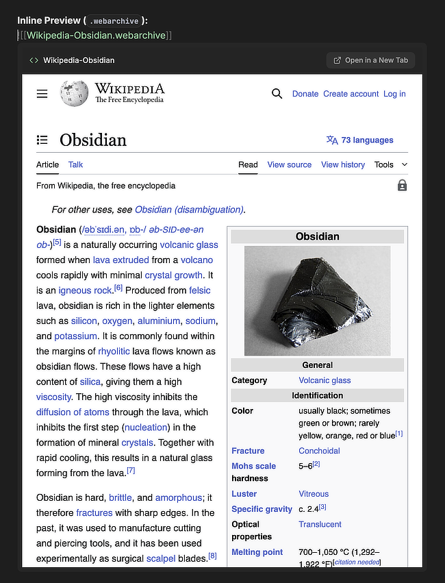

# Embeds+
A plugin for extending the native in-app file previewing/rendering capabilities of Obsidian.
## About
The purpose of Embeds+ is to allow for Evernote-style "web snippets" to be rendered inside Obsidian notes (or in separate tabs). The plugin currently supports in-app rendering of the following file formats:
- `.webarchive`
- `.html`
- `.mhtml` (`.mht`) 
## Usage
Opening the file (as you would for any other note/document) will open the rendered file in a new tab. To insert an inline preview, use the native syntax for inline previews: `![[File.html]]`.

**Example:**

### Capturing Evernote-Like "Web Clips"
Below are some examples of how to capture these web snippets on different platforms/browsers:
**Web Archives:**
- Using Safari on i(Pad)OS/MacOS:
	- **i(Pad)OS:** *Share -> Options -> Send As -> Web Archive*
	- **MacOS:** *File -> Save As (⌘ S) -> Format -> Web Archive*
**MHTML:**
- Using Chromium-based browsers on Desktop:
	- *Menu -> Save Page As (⌘ S) -> Web page, Single file*
There are also many tutorials for capturing Web Archives using Apple's Shortcuts app, or capturing `.mhtml` files using browser extensions and apps.
## Additional Notes
- External links, navigation links, and moving elements (CSS & JavaScript) are disabled on the embeds for safety and to ensure usability. This behaviour may be changed in future iterations.
- Web Archive files are large, so having a lot of them in your vault/notes can slow down Obsidian considerably. Stick to minimal (M)HTML snippets where possible.
## Installation
Embeds+ is not available via Obsidian Community Plugins at the moment. The plugin is in a *very* alpha stage, it may be polished and added to community plugins at some point. For now, it can either be manually installed, or installed via [BRAT](https://obsidian.md/plugins?id=obsidian42-brat).
### Manual Installation
1. Create a directory for the plugin: `/path/to/your/vault/.obsidian/plugins/obsidian-embeds-plus`.
2. Download & extract the `.zip` archive for the latest version in [Releases].
3. Place `main.js`, `manifest.json`, and `styles.css` inside the newly-created plugin folder.
## Credits
- [`@plist/plist`](https://github.com/TooTallNate/plist.js/tree/master/packages/plist) by [TooTallNate](https://github.com/TooTallNate).
## License
- [Apache License, Version 2.0](https://www.apache.org/licenses/LICENSE-2.0.html).

> [!NOTE] 
> First-party code in this repository is _not_ generated by (or with the assistance of) an AI/LLM. External code, libraries, or assets used in this repository may contain AI-generated content.
> 