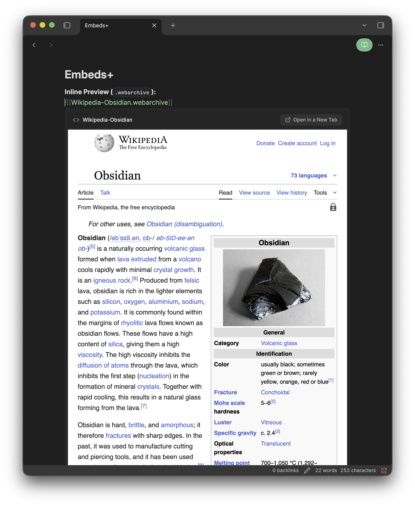
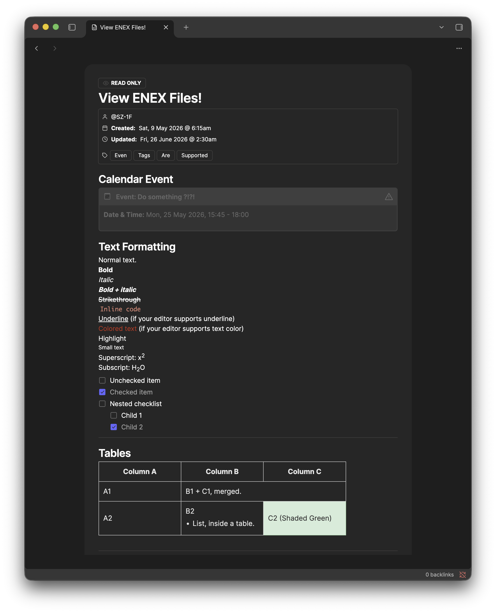

# Embeds+
A plugin for extending the native in-app file previewing/rendering capabilities of Obsidian.
## About
The purpose of Embeds+ is to extend the compatible file types that can be rendered natively inside Obsidian. Using Embeds+ also allows for Evernote-style "web snippets" to be rendered within notes (or in separate tabs), and viewing Evernote export (ENEX) files natively. 

The plugin currently supports in-app rendering of the following file formats:
- Apple Web Archives: `.webarchive`
- Standard HTML: `.html`
- MIME HTML: `.mhtml` (or `.mht`) 
- Evernote Exports: `.enex`\*

\*ENEX is limited, see [ENEX File Support](#enex-file-support)
## Usage
Opening a supported file (as you would for any other note/document) will render it in a new tab. To insert an inline preview, use the native syntax for inline previews: `![[File.html]]`.

**Example:**

### Capturing Evernote-Like "Web Clips"
Below are some examples of how to capture these clips on different platforms/browsers:
**Web Archives:**
- Using Safari on i(Pad)OS/MacOS:
	- **i(Pad)OS:** *Share -> Options -> Send As -> Web Archive*
	- **MacOS:** *File -> Save As (⌘ S) -> Format -> Web Archive*
**MHTML:**
- Using Chromium-based browsers on desktop:
	- *Menu -> Save Page As (⌘ S) -> Web page, Single file*
There are also many tutorials for capturing Web Archives using Apple's Shortcuts app, or capturing `.mhtml` files using browser extensions and apps.
### ENEX File Support
You can now open `.enex` files directly inside Obsidian, allowing you to see the contents of individual notes as they would appear in Evernote. `.enex` files will be read-only; this feature is for referencing archived content, while preserving styles/formatting that would otherwise be lost by converting them. 

Most basic formatting elements are supported, including:
- Standard HTML elements (e.g. headers, bolded & italicised text, bullet lists, quote blocks, etc.).
- Some custom Evernote elements: Mermaid diagrams, TeX formulas, Evernote tasks, note tags, image attachments, web clips, callouts, etc.
Some elements and formatting are not yet supported, such as: 
 - Tables of contents, inline tags, attachments other than images. 
Support for these will be added in the near future.

 > [!NOTE]
 > Currently, only ENEX files containing single notes are supported. If a Notebook or Space is opened, only the first note will be read.

**Example:**

## Additional Notes
- External links, navigation links, and moving elements (CSS & JavaScript) are disabled in the embeds for safety and usability. This behaviour may be changed in future iterations.
- While extra care has been taken to strip any embedded content that makes network requests or attempts to run scripts, ensure any media you're storing is from a trusted source.
- Web Archive files are large, so having a lot of them in your vault/notes can slow down Obsidian considerably. Stick to minimal (M)HTML snippets where possible.
## Installation
### Via Obsidian Community Plugin
Embeds+ is now available to download via the official [Obsidian Community Plugins](https://community.obsidian.md/plugins/embeds-plus) repository.
### Via [BRAT](https://obsidian.md/plugins?id=obsidian42-brat)
1. Install and enable the BRAT community plugin.
2. Using the [Command Palette](https://obsidian.md/help/plugins/command-palette), search for: `BRAT: Plugins: Add a beta plugin for testing (with or without version)`.
3. Add the URL for this GitHub repository (https://github.com/SZ-1F/obsidian-embeds-plus).
You can either choose to install the latest version (recommended), or manually select a specific release.
### Manual Installation
1. Create a directory for the plugin: `/path/to/your/vault/.obsidian/plugins/embeds-plus`.
2. Download & extract the `.zip` archive for the latest version in Releases.
3. Place `main.js`, `manifest.json`, and `styles.css` inside the newly-created plugin folder.
## Credits
- [`@plist/plist`](https://github.com/TooTallNate/plist.js/tree/master/packages/plist) by [TooTallNate](https://github.com/TooTallNate).
- [`node-html-parser`](https://github.com/taoqf/node-html-parser) by [taoqf](https://github.com/taoqf).
- [`spark-md5`](https://github.com/satazor/js-spark-md5) by [satazor](https://github.com/satazor).
- [`tslog`](https://github.com/fullstack-build/tslog) by [fullstack-build](https://github.com/fullstack-build).
## License
- [Apache License, Version 2.0](https://www.apache.org/licenses/LICENSE-2.0.html).
> [!NOTE]
> First-party code in this repository is _not_ generated by (or with the assistance of) an AI/LLM. External code, libraries, or assets used in this repository may contain AI-generated content.
> 

